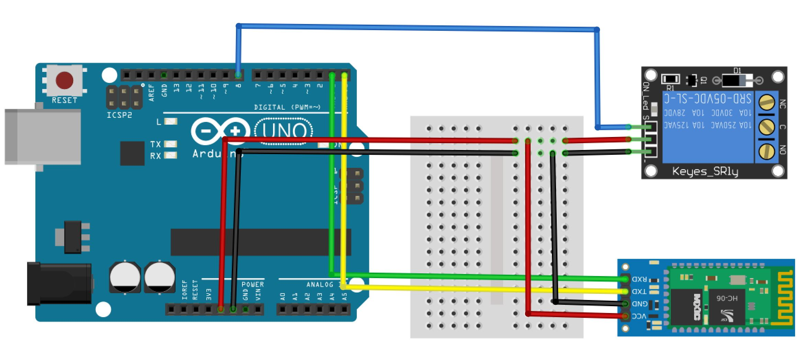

# Ejercicio base: Comunicación Bluetooth entre Arduino y Bluetooth
Este es el primer ejercicio que debes realizar si se trata de comenzar a trabajar con la comunicación Bluetooth entre Arduino y Android, definitivamente con todas las ideas que pueden salir de aquí ¡tendrás muchos proyectos por realizar!

## Lista de material

Para este ejercicio, lo más recomendable es contar con este material:

Un Arduino Uno 
Un módulo de relevador de corriente
Un sensor HC-06
Varios jumpers

## Configuración de cableado

En la siguiente imagen podrás ver cómo funciona la organización del cableado para el sistema que vamos a utilizar.

Al descargar o clonar el repo completo podrás ver la imagen en tamaño real y también el diagrama de Fritzing.

En este ejercicio es de vital importancia que veas que el pin TX (reloj) y RX (lectura) del HC-06 está en posiciones invertidas con respecto a la posición de los mismos pines de Arduino. La alimentación tanto del relevador de corriente como de la antenta de Bluetooth es de 5V.

## El código de Arduino

Después del cableado, el código de Arduino está en su la [sección adecuada](https://github.com/aminespinoza/Bluetooth-entre-Arduino-y-Bluetooth/tree/master/Bluetooth_basico). Aquí considera que el código está hecho para Arduino Uno ya que esta tarjeta solo cuenta con un serial así que si quieres ver en el serial y comunicarte por Bluetooth debes utilizar la clase de Software Serial. Si utilizas un Arduino Mega tienes más seriales y no necesitarías utilizar esta clase. Si quieres hacerlo con Arduino Mega podrías aprovechar el [proyecto que ya publiqué] (https://github.com/aminespinoza/Escritorio-luminoso) de un escritorio luminoso que establece esta comunicación usando este modelo en particular.

Dentro del código debes ver que solo recibirás un valor por medio de la señal de Bluetooth. Con esta respuesta recibida, ya sea 0 o 1 el relevador se encenderá o se apagara además de que la terminal del seríal mostrará los resultados para indicar que la antena está conectada a la aplicación y además que se ha ejecutado una acción.

## El código de Xamarin

En el caso del proyecto de Xamarin podrás ver varias cosas. Todo se encuentra dentro de la clase MainActivity.cs y hay cuatro métodos que debes considerar.

| Nombre | Concepto principal | 
| --------- | -------------------- | 
| CheckBluetoothDevice | Este método eválua los dispositivos conectados y enlista los posibles dispositivos |
| Connect | Fácil ¿no? Es el método que establece la conexión con el dispositivo |
| BeginListenForData | Este método trabaja en recibir la información que el otro dispositivo Bluetooth te pueda enviar |
| WriteData | Este método es el que genera y envía la información al otro dispositivo |

El primer y tercer métodos están listos para utilizar pero no son invocados en este ejercicio, lo mejor que puedes hacer es crear nuevos escenarios y ver cómo utilizar estas posibilidades como obtener la información del clima de un sensor DHT11 o cosas así, definitivamente aquí hay grandes posibilidades de nuevas cosas. 

Si tienes alguna duda solo escribe en los Issues y lo podemos ir solucionando.

¡Disfruta!

